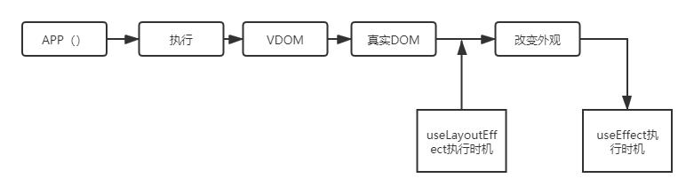
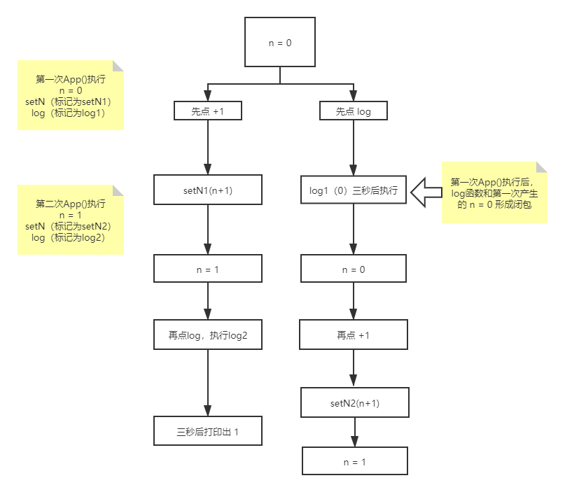

### React 函数组件

```jsx
const Hello = (props) => {
  return <div>{props.message}</div>
}
```

#### 使用函数组件替代类组件的两个问题

- 没有 state
- 没有生命周期

#### useEffect

更合适的名字可能是"afterRender",useEffect 在浏览器渲染完成后执行。

- 模拟 componentDidMount
  ```javascript
  useEffect(() => {
    console.log('第一次渲染')
  }, [])
  ```
- 模拟 componentDidUpdate
  ```javascript
  useEffect(() => {
    console.log('任意属性变更')
  })
  useEffect(() => {
    console.log('n变了')
  }, [n])
  ```
- 模拟 componentWillUnmount
  ```javascript
  useEffect(() => {
    console.log('第一次渲染')
    return () => {
      console.log('组件要死了')
    }
  })
  ```

##### 特点

如果同时存在多个 useEffect，会按照出现次序执行

##### useLayoutEffect

- useLayoutEffect 在浏览器渲染前执行
- useLayoutEffect 总是比 useEffect 先执行
- useLayoutEffect 里的任务最好影响了 Layout，否则不应该放在渲染过程中执行
- 为了用户体验，建议优先使用 useEffect(优先渲染)
  

##### 自定义 Hooks

注意:自定义 Hooks 必须以 use 开头

```javascript
//自定义一个依赖变化时执行的 hook ，第一次初始化时除外
const useUpdate = (fn, dep) => {
  const [count, setCount] = useState(0)
  useEffect(() => {
    setCount((x) => x + 1)
  }, [dep])
  useEffect(() => {
    if (count > 1) {
      fn()
    }
  }, [count, fn])
}
```

#### useState

```javascript
const [n, setN] = React.useState(0)
const [user, setUser] = React.useState({ name: 'F' })
```

##### 注意

- setState 不能局部更新，因为 setState 不会帮我们合并属性
- setState(obj) 如果 obj 地址没变，React 就认为数据没有变化

##### useState 的简单实现

```javascript
let _state =[];
let index = 0;
const myUseState = (initialValue)=>{
    const currentIndex = index
    _state[currentIndex] = _state[currentIndex] === undefined ? initialValue : _state[currentIndex]
    const setState(newState){
        _state[currentIndex] = newState;
        render() //重新渲染页面
    }
    index += 1
    return [_state[currentIndex],setState]
}
const render = ()=>{
    index = 0;
    ReactDOM.render(<App/>,rootElement)
}
```

##### 目前方案的缺点

调用顺序很重要，每次渲染时必须保证顺序完全一致。React 中也不允许出现下面的代码

```javascript
function App() {
  const [n, setN] = React.useState(0)
  let m, setM
  // 下面的代码会打乱顺序，导致返回错的 [m,setM]
  if (n % 2 === 1) {
    ;[m, setM] = React.useState(0)
  }
  const [k, setK] = React.useState(0)
}
```

##### React useState 的实现

- 每个函数组件对应一个 React 节点
- 每个节点保存着 state 和 index
- useState 会读取 state[index]
- index 由 useState 出现的顺序决定
- setState 会修改 state，并触发更新

##### 如何拥有一个贯穿始终的状态

- 全局变量
  用 window.xxx 即可，但太 low 了
- useRef
- useContext

#### useReducer

复杂版的 useState

```jsx
const initial = {
  n: 0,
}
const reducer = (state, action) => {
  if (action.type === 'add') {
    return { n: state.n + 1 }
  } else {
    if (action.type === 'multi') {
      return { n: state.n * 2 }
    } else {
      throw new Error('unknown type')
    }
  }
}
function App() {
  const [state, dispatch] = useReducer(reducer, initial)
  const onClick = () => {
    dispatch({ type: 'add' })
  }
  return (
    <div>
      <h1>n:{n}</h1>
      <button onClick={onClick}>+1</button>
    </div>
  )
}
```

##### 如何使用 useReducer 代替 Redux

- 将数据集中在一个 store 对象
- 将所有操作集中在 reducer
- 创建一个 Context
- 创建对数据的读写 API
- 将第四步的内容放到第三步的 Context
- 用 Context.Provider 将 Context 提供给所有组件
- 各个组件用 useContext 获取 读写 API

[一个例子](https://codesandbox.io/s/interesting-volhard-lfxpm?file=/src/index.js)

#### useContext

Context 即上下文，全局变量是全局的上下文，上下文是局部的全局变量。

##### 使用方法

1. 使用 C = createContext(initial) 创建上下文
2. 使用 <C.provider> 圈定作用域
3. 在作用域内使用 useContext(C) 来使用上下文

##### 注意事项

useContext 里元素的更新并不是响应式的，你在一个模块里将上下文的值更新，另一个模块并不会立刻感知到这个变化。数据改变是一个从上而下逐级通知的过程，而不是监听了数据的变化，通知相对应的组件。

#### memo 和 useMemo

[React 默认会有多余的 renderer](https://codesandbox.io/s/dawn-sun-00023?file=/src/index.js)，使用 React.memo 可以使组件只有在 props 变化的时候重新渲染。

##### 一个问题

如果 props 中有函数会导致 React.memo 失效，使用 useMemo 可以重用相对应的函数。

```jsx
function App() {
  const [m, setM] = useState(0)
  const onClick = useMemo(() => {
    return () => {
      console.log(m)
    }
  }, [m])
  return (
    <div>
      <Child data={m} onClick={onClick} />
    </div>
  )
}
```

##### useMemo 的特点

- 第一个参数是 ()=> value
- 第二个参数是依赖 [m,n]
- 只有当依赖变化时，才会计算出新的 value，类似于 Vue 里的 computed

#### useCallback

useCallback(x=>log(x),[m]) 等价于 useMemo(()=>x=> log(x),[m])

#### useRef

可以用来引用 DOM 对象，也可以用来引用普通对象。作用是在组件不断 render 时保持不变

##### 为什么需要用 current ？

因为旧组件和新组件引用的必须是同一个对象，只有引用可以做到这点。

#### forwardRef

由于函数组件 props 不包含 ref，所以需要 forwardRef，[一个例子](https://codesandbox.io/s/crazy-matsumoto-6l6mh)

#### useImperativeHandle

其实就是 setRef，自定义封装 ref，[一个例子](https://codesandbox.io/s/elegant-poitras-mxoym?file=/src/index.js)

#### Stale Closure

过时的闭包，用于描述你的函数引用的变量是之前产生的旧的变量。

```jsx
function App(){
    const [n,setN] = useState(0);
	const log = ()=> setTimeout(()=> console.log(`n:${n}`),3000);
    return (
        <div>
            <span>{n}</span>
            <button onClick={log}>+1</button>
            <button onClick={()=>setN(n + 1)}>+1</button>
        </div>
    )
}
```

执行上面的代码，进行以下两种操作：

- 点击 +1 按钮再点击 log
- 点击 log 再点击 +1 

第一种操作看起来没什么问题，但第二种操作 console.log 打印出的却是旧的 n。原因就是上面提到的，log 函数引用的 n 是之前产生的旧的 n。



##### Stale Closure 总结

- 每次 setState(新的数据)就会触发重新渲染，组件函数就会执行
- 对应的所有 state 就会出现【分身】，就比如上面提到的，App 第一次执行，函数中的 n = 0，第二次执行函数中的 n = 1，它们是不同的 n。
- 如果你不希望出现分身，可以使用 useRef/useContext 等

